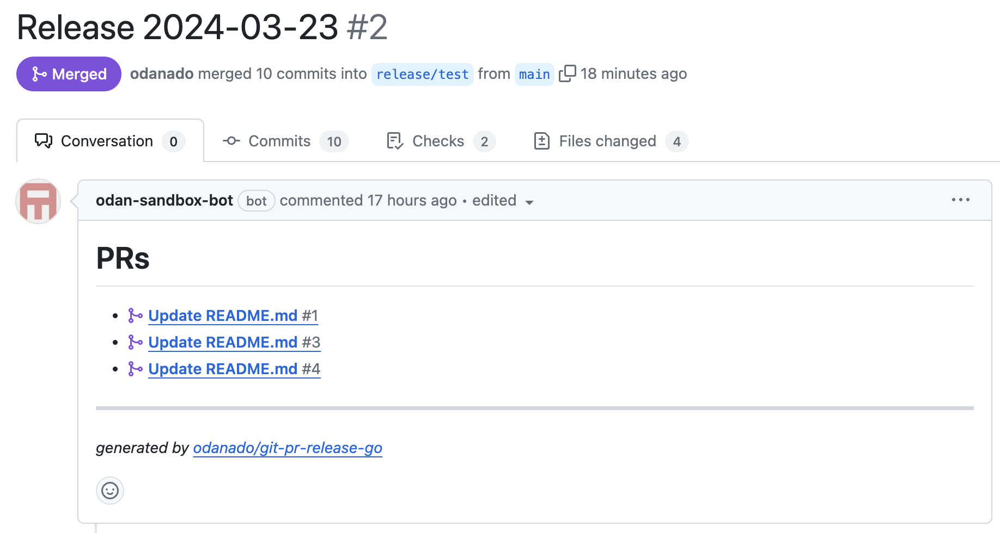

# git-pr-release-go

Go implementation of [git-pr-release][https://github.com/x-motemen/git-pr-release].

This command creates "Release Pull Request" on GitHub. The body of "Release Pull Request" lists the pull requests included in that release.



# Usage

```bash
$ git-pr-release-go --from main --to release/production
```

## Usage in GitHub Actions

```yaml
name: Create Release Pull Request
on:
  push:
    branches:
      - main

jobs:
  create-release-pr:
    runs-on: ubuntu-latest
    steps:
      - uses: actions/create-github-app-token@v1
        id: app-token
        with:
          app-id: ${{ vars.APP_ID }}
          private-key: ${{ secrets.PRIVATE_KEY }}

      # Download git-pr-release-go

      - run: ./git-pr-release-go --from main --to release/production
        working-directory: git-pr-release-go
        env:
          GITHUB_TOKEN: ${{ steps.app-token.outputs.token }}

```

## Options

- `--from`: The base branch name. Required.
- `--to`: The target branch name. Required.

## Environment Variables

- `GITHUB_TOKEN`: GitHub API token. Required.
- `GITHUB_REPOSITORY`: GitHub repository name. Required.

# Compare with git-pr-release

It is implemented in go, so all you need is a binary file to use it. It does not require Ruby.


## Migration from git-pr-release

TDB

# TODO
- [ ] Support GitHub Enterprise Server
- [ ] Support a custom template
- [ ] Support custom labels
- [ ] Add testing
- [ ] Add CI/CD
